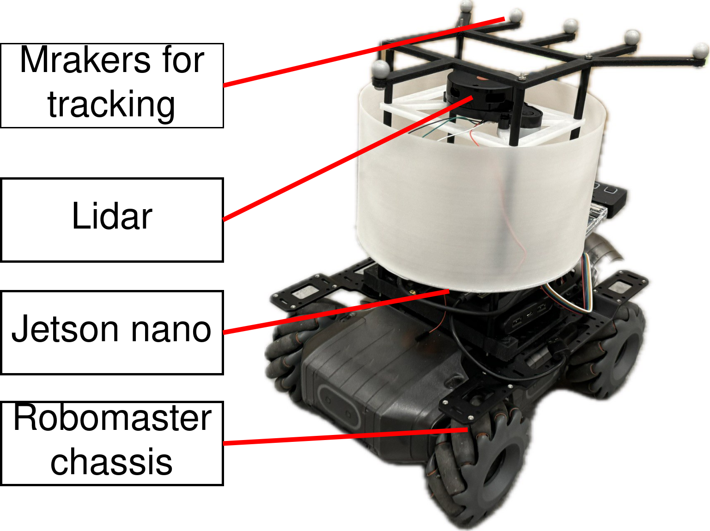

# A simple platform for multi-robot control with ROS

## Robot platform

This is a customized mobile robot for multi robot control tasks.

The robot platform consists of the RoboMaster EP Core as the chassis, which is a four mecanum-wheeled holonomic mobile, 
The Jetson Nano as the onboard computer, and a Youyeetoo LD20 Lidar sensor as the onboard sensor. 
The markers placed on the top is for robot tacking with Opti-track.

The Lidar and robot chassis use serial port to communicate with the Jetson nano.

## Prerequisites
* Robot platform: Robomaster EP Core
* Sensor: youyeetoo LD20
* Operating system: Ubuntu 18.04/Ubuntu 20.04
* ROS version: melodic/noetic 
## Dependencies
* ROS package
  * [Lidar Driver](https://wiki.youyeetoo.com/en/Lidar/LD20)
* Opencv 3.0
* Other python package
  * pyrealsense2
  * cv2
  * socket
  * scipy
  * pandas
## Usage

### Multi-robot formation with ViT controller
  
* Make sure you have placed the [Learning Decentralized Formation Using Transformer codes](https://github.com/SIT-Robotics-and-Automation-Laboratory/vit_formation_control.git)
  into your working space.
* Make sure you have placed the [Youyeetoo driver](https://wiki.youyeetoo.com/en/Lidar/LD20)
  into your working space.
* Robot connection
  1. Make sure the lidar sensor and the robot chassis is connected to the jetson nano properly.
  2. Give the 777 permission to the port by run
  
     `sudo chmod 777 /dev/ttyUSB*`

  3. Give the permission to the serial port by run:
    
     `sudo su`
    
     `chown jetson /dev/ttyUSB0` or `chown jetson /dev/ttyUSB1`
* Start the robot
    
  `roslaunch vit_formation_control real_robot_test.launch`

### Multi-robot formation with expert controller

* Robot connection
  1. Make sure computer and all robots are connected to same WIFI(Follow the [instruction](https://robomaster-dev.readthedocs.io/en/latest/) to connect robomaster)
  2. Run check_ip.py to get each robots' IP (connect robot to WIFI one by one )
  3. Record the IP address of each robot by setting the self.IP_DICT attribute using ImageListener in expert_control.py. Ensure that the IP address corresponds to the color of each robot.
* Expert Control
  1. Start ROS

  `roscore`
  
  2. Start realsense camera
  
  `roslaunch realsense2_camera rs_rgbd.launch `
  
  3. Start cmvision_3d
  
  `roslaunch cmvision_3d color_tracker.launch `
  
  4. Start expert control 
  
  `rosrun multi_robot_formation expert_control.py `
  

